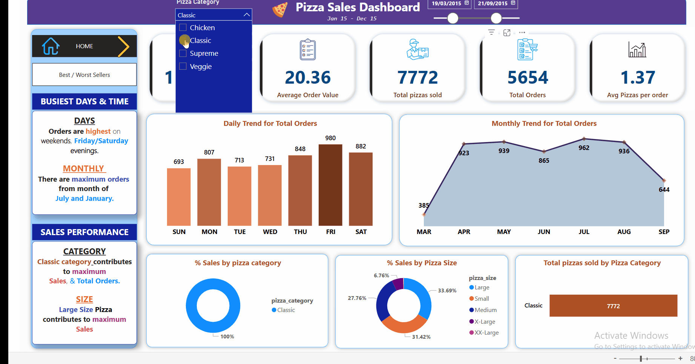
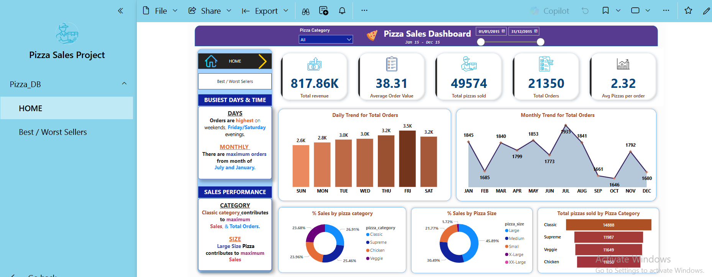
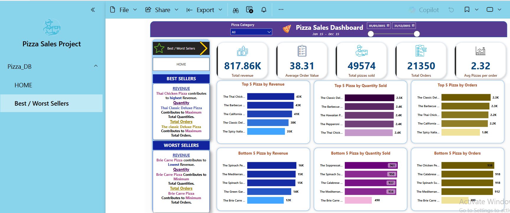

# 🍕 Pizza Sales Analysis – SQL + Power BI

This project presents a detailed sales analysis of a fictional pizza shop using SQL and Power BI. It focuses on uncovering revenue trends, top-selling products, customer ordering behavior, and product category performance.

---

## 📌 Project Objective

To build a dynamic dashboard that helps the business understand:
- Revenue drivers and performance
- Daily and monthly sales trends
- Best and worst performing pizzas
- Sales distribution by category and size

---

## 🔧 Tools & Technologies Used

- **SQL Server / MySQL** – for data extraction and transformation
- **Power BI** – for dashboard creation and insights visualization
- **Excel** – for initial data inspection

---

## 📊 Dashboard Preview

Additional screenshots:
- 
- 

---

## 🧮 Key KPIs

- ✅ Total Revenue  
- ✅ Average Order Value  
- ✅ Total Pizzas Sold  
- ✅ Total Orders  
- ✅ Average Pizzas per Order  

-- sql
-- Total Revenue
SELECT SUM(total_price) AS Total_Revenue FROM pizza_sales;

-- Average Order Value
SELECT (SUM(total_price) / COUNT(DISTINCT(order_id))) AS Average_order_value FROM pizza_sales;

-- Total Orders
SELECT COUNT(DISTINCT(order_id)) AS Total_orders FROM pizza_sales;

## 📈 Sales Insights & Trends
# 📅 Order Trends:
Daily Orders by Day of Week

Monthly Orders by Month Name

SELECT DATENAME(DW, order_date) AS order_day, COUNT(DISTINCT(order_id)) AS Total_orders 
FROM pizza_sales
GROUP BY DATENAME(DW, order_date);

## 🧩 Category & Size Contributions:

Percentage Sales by Pizza Category & Pizza Size

Filtered by month and quarter

## 🥇 Top & Bottom Performers

Top 5 by Revenue, Quantity, and Orders

Bottom 5 by Quantity and Orders

-- Top 5 by Revenue
SELECT TOP 5 pizza_name, SUM(total_price) AS Total_sales 
FROM pizza_sales
GROUP BY pizza_name
ORDER BY Total_sales DESC;

## 💡 Key Business Insights

Regular-sized pizzas are the most popular across all quarters

Classic and Supreme categories lead in both quantity and revenue

Weekends and evenings see the highest order volume

A few pizzas contribute disproportionately to total revenue

## 🧠 Skills & Learnings
Writing optimized SQL using GROUP BY, DATEPART, and aggregations

Data storytelling with visual insights

Dashboard UI/UX design in Power BI

Business-oriented analysis and insight extraction

## 📁 Project Assets
pizza_sales.csv – Raw dataset

Power BI visuals (screenshots + GIF)

SQL scripts for KPI & chart extraction

This README

## 📬 Contact
Name: Nikhil Chavan

Email: nikhilcaptain4@gmail.com

LinkedIn: linkedin.com/in/nikhil-c-993548151

## 🔒 This project is shared for educational & portfolio purposes only.
